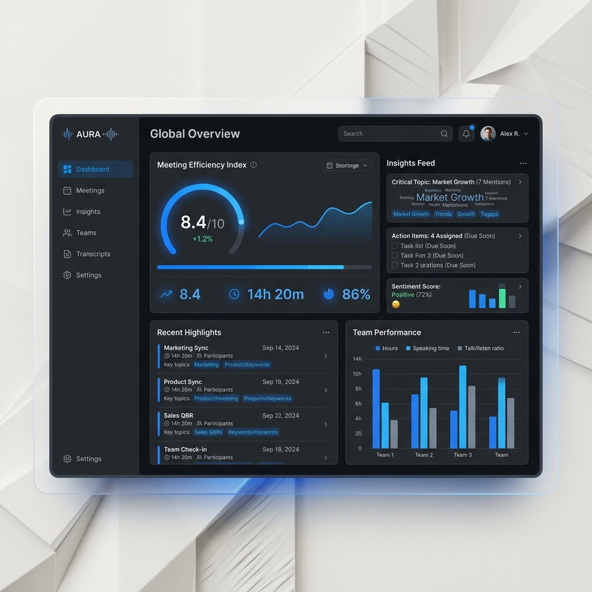

<div align="center">
  

  <br />
  <br />

# ⚡ Axiom: Enterprise Meeting Protocol

**Hệ Điều Hành Doanh Nghiệp Số (DX-OS) - Giao thức họp On-Premise bảo mật cao** <br />
_Được phát triển cho Olympic Phần mềm Nguồn mở (PMNM) 2026_

[](https://opensource.org/licenses/MIT)
[](https://nextjs.org/)
[](https://fastapi.tiangolo.com/)
[](https://tasteskill.dev)
[](<>)

</div>

---

## 📖 Giới Thiệu

**Axiom** không chỉ là một ứng dụng gọi video thông thường. Đây là một **Hệ Điều Hành Doanh Nghiệp Số (DX-OS)** được thiết kế dựa trên kiến trúc 4 lớp **H-P-D-I**:

- 🧑‍💻 **H (Human - Con Người):** Giao diện tập trung, loại bỏ sự xao nhãng. Tích hợp Jitsi Meet trực tiếp.
- ⚙️ **P (Process - Quy Trình):** Các "Rào chắn" (Gates) như ép buộc phải có Agenda chi tiết trước khi họp.
- 🔒 **D (Data - Dữ Liệu):** Cơ sở dữ liệu On-Premise, đảm bảo chủ quyền dữ liệu tuyệt đối cho doanh nghiệp.
- 🧠 **I (Intelligence - Trí Tuệ):** Whisper bóc băng ghi âm theo thời gian thực & Llama-3 tóm tắt nội dung cuộc họp.

## ✨ Tính Năng Nổi Bật

- **Agenda Gate (Rào chắn Agenda):** Bắt buộc nhập chương trình họp rõ ràng, minh bạch (Backend kiểm tra nghiêm ngặt).
- **Jitsi Native IFrame:** Gọi video ngay trên trình duyệt, hạ tầng sẵn sàng cho tự lưu trữ (Self-hosted).
- **Thiết Kế Taste Skill:** Giao diện B2B Enterprise SaaS với tông màu Electric Blue và font chữ Geist cao cấp.
- **TDD Workflow:** Quy trình phát triển mã nguồn siêu cường (Superpowers TDD: Red-Green-Refactor) đảm bảo độ tin cậy của API lên đến 99.9%.

---

## 📂 Cấu Trúc Thư Mục Chuẩn

```text
📦 Smart_Meeting_AI
 ┣ 📂 backend                 # Backend API (Python / FastAPI)
 ┃ ┣ 📜 main.py               # Entry point & API Routes
 ┃ ┣ 📜 models.py             # SQLAlchemy Models (CSDL)
 ┃ ┣ 📜 database.py           # Thiết lập kết nối SQLite/PostgreSQL
 ┃ ┣ 📜 test_main.py          # Bộ Test TDD (Pytest)
 ┃ ┗ 📜 requirements.txt      # Dependencies cho Backend
 ┣ 📂 frontend                # Frontend Web (Next.js 14 / React 19)
 ┃ ┣ 📂 public                # Tài nguyên tĩnh (Hình ảnh, Icon)
 ┃ ┣ 📂 src
 ┃ ┃ ┣ 📂 app                 # App Router (Next.js)
 ┃ ┃ ┃ ┣ 📂 meetings          # Bảng điều khiển cuộc họp (Dashboard)
 ┃ ┃ ┃ ┣ 📜 layout.tsx        # Base layout (Geist font, Metadata)
 ┃ ┃ ┃ ┣ 📜 page.tsx          # Trang chủ Landing Page (Split Layout)
 ┃ ┃ ┃ ┗ 📜 globals.css       # Cấu hình màu sắc chuẩn TasteSkill
 ┃ ┃ ┣ 📂 components          # React Components (Shadcn UI)
 ┃ ┃ ┗ 📂 lib                 # Utils (Tailwind merge)
 ┃ ┣ 📜 tailwind.config.ts    # Cấu hình Tailwind CSS
 ┃ ┗ 📜 package.json          # Dependencies cho Frontend
 ┣ 📂 docs                    # Tài liệu kỹ thuật dự án
 ┃ ┣ 📜 ARCHITECTURE.md       # Kiến trúc H-P-D-I chi tiết
 ┃ ┣ 📜 CONTRIBUTING.md       # Hướng dẫn đóng góp (TDD & TasteSkill)
 ┃ ┗ 📜 DEPLOYMENT.md         # Hướng dẫn triển khai (Dev & Prod)
 ┣ 📜 MVP.md                  # Định nghĩa phạm vi Minimum Viable Product
 ┗ 📜 README.md               # File thông tin tổng quan (Bạn đang đọc file này)
```

---

## 🚀 Khởi Chạy Môi Trường Phát Triển (Local)

Vui lòng tham khảo hướng dẫn chi tiết tại tài liệu [DEPLOYMENT.md](./docs/DEPLOYMENT.md).

### 1. Khởi động Backend (FastAPI)

```bash
cd backend
pip install -r requirements.txt # (Nếu đã tạo) hoặc cài fastapi uvicorn sqlalchemy pytest
uvicorn main:app --reload
# API Server chạy tại: http://localhost:8000
```

### 2. Khởi động Frontend (Next.js)

```bash
cd frontend
npm install
npm run dev
# Web Server chạy tại: http://localhost:3000
```

---

## 📚 Tài Liệu Hướng Dẫn

- [Kiến trúc Hệ thống (ARCHITECTURE.md)](./docs/ARCHITECTURE.md)
- [Quy định Đóng góp (CONTRIBUTING.md)](./docs/CONTRIBUTING.md)
- [Phạm vi Dự án (MVP.md)](./MVP.md)

<div align="center">
  <br/>
  <i>Được xây dựng với 🩵 cho Olympic PMNM 2026. Bền vững. Bảo mật. Kỷ luật.</i>
</div>
