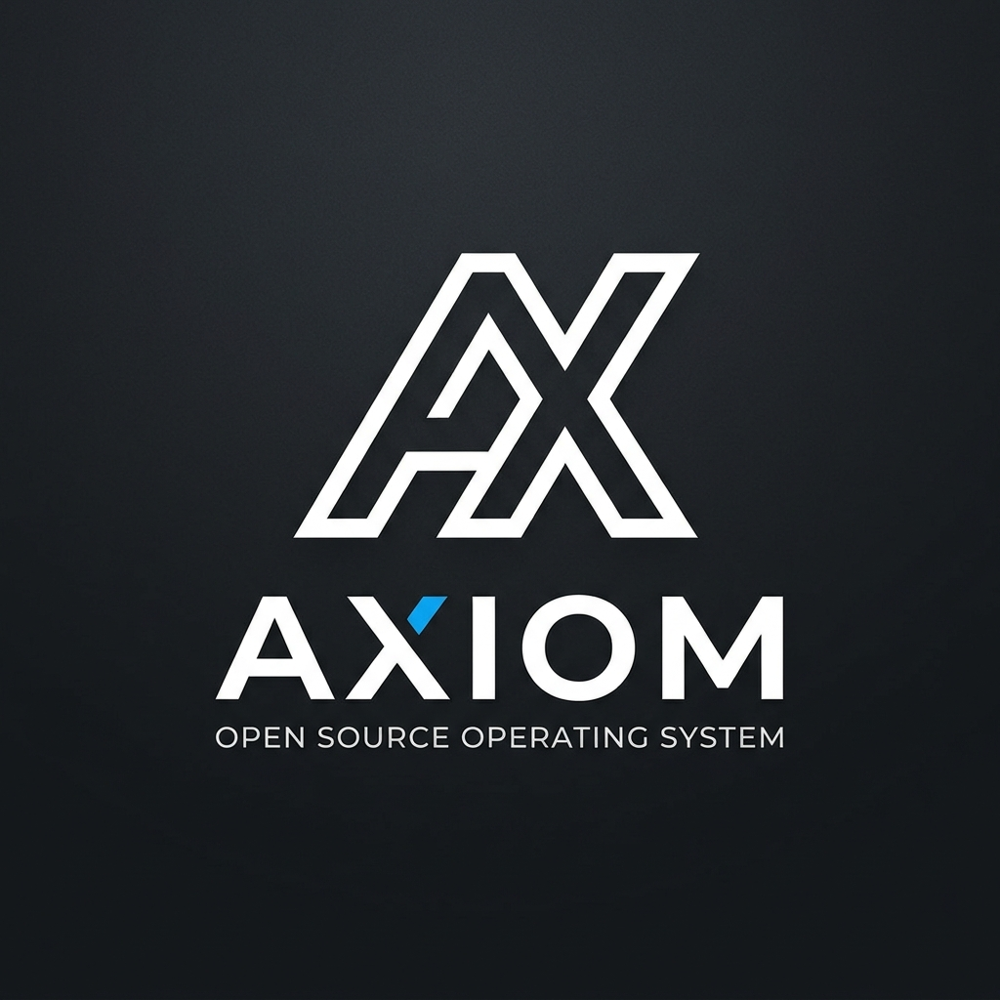

<div align="center">
  
  <br/>
  <h1>⚡ Axiom: Enterprise Meeting Protocol</h1>

**Digital Enterprise Operating System (DX-OS)** <br />
_A High Security On-Premise Meeting Protocol for the Modern Enterprise_

  <br />

[](https://opensource.org/licenses/MIT)
[](https://nextjs.org/)
[](https://fastapi.tiangolo.com/)
[](https://livekit.io/)
[](src/backend/test_main.py)
[](https://prettier.io/)
</div>

---

## 📖 Introduction

**Axiom** is an open-source **Enterprise Meeting Protocol** designed as a "Digital Enterprise Operating System (DX-OS)." It solves fragmented, undisciplined, and insecure corporate meetings by:

- 🧑‍💻 **H (Human):** A focused, distraction-free interface with native LiveKit WebRTC integration.
- ⚙️ **P (Process):** Process gates that enforce discipline (e.g., mandatory ≥20-char agendas before meetings).
- 🔒 **D (Data):** On-premise database ensuring absolute data sovereignty for enterprises.
- 🧠 **I (Intelligence):** Real-time audio transcription (Whisper) & meeting summarization (Llama-3).

For the comprehensive engineering roadmap and full project vision, see [`MASTER_PROJECT_PLAN.md`](./MASTER_PROJECT_PLAN.md).

---

## ✨ Key Features

- **🚀 LiveKit WebRTC:** Browser-based, high-performance video calling powered by LiveKit Server. No external software required.
- **🛡️ Agenda Gate (Discipline Protocol):** Enforces clear, structured meeting agendas. Backend-validated Process Gate blocks meetings without a detailed ≥20-character agenda.
- **🎨 Premium B2B Aesthetic:** World-class UI/UX with Plus Jakarta Sans typography, Electric Blue accents, and React Bits interactive components.
- **🔐 Absolute Data Sovereignty:** Run it in your own VPC. SQLite (Dev) → PostgreSQL (Prod). Meeting data never leaves your infrastructure.
- **🧪 TDD Tested:** 35 backend tests covering CRUD, Process Gate validation, API versioning, structured error responses, and edge cases.
- **📐 Modular Architecture:** Clean separation — `core/`, `schemas/`, `api/v1/` modules with centralized config and exception handling.

---

## 🛠️ Technology Stack

| Category            | Technology                                                  | Purpose                                                          |
| :------------------ | :---------------------------------------------------------- | :--------------------------------------------------------------- |
| **Frontend**        | [Next.js 16](https://nextjs.org/) / React 19                | Server-side rendering, routing, static UI delivery.              |
| **Styling**         | [Tailwind CSS v4](https://tailwindcss.com/) / Shadcn UI     | Utility-first rapid styling and accessible component primitives. |
| **Backend**         | [FastAPI](https://fastapi.tiangolo.com/) / Pydantic V2      | High performance async Python API with strict data validation.   |
| **Real-time Comms** | [LiveKit](https://livekit.io/)                              | Enterprise WebRTC infrastructure (self-hosted).                  |
| **Database**        | [SQLAlchemy](https://www.sqlalchemy.org/) / SQLite          | Relational ORM for strictly-typed data modeling.                 |
| **Migrations**      | [Alembic](https://alembic.sqlalchemy.org/)                  | Database schema version control.                                 |
| **Package Manager** | [uv](https://github.com/astral-sh/uv) (Python) / npm (Node) | Extremely fast, reliable dependency resolution.                  |

---

## 🚀 Quick Start (Local Development)

Getting Axiom running locally requires **Node.js (v20+)**, **Python (v3.12+)**, and **uv**. For detailed production deployment, refer to [DEPLOYMENT.md](./docs/DEPLOYMENT.md).

### 1. Clone & Install

```bash
git clone https://github.com/khoazandev/Axiom-meeting-protocol.git
cd Axiom-meeting-protocol

# Install Backend dependencies (using uv)
uv sync --all-extras

# Install Frontend dependencies
cd src/frontend && npm ci && cd ../..
```

### 2. Configure Environment

**Backend** — create `src/backend/.env`:

```env
LIVEKIT_API_KEY=devkey
LIVEKIT_API_SECRET=secret
LIVEKIT_URL=ws://localhost:7880
DATABASE_URL=sqlite:///./sql_app.db
```

**Frontend** — create `src/frontend/.env.local`:

```env
NEXT_PUBLIC_LIVEKIT_URL=ws://localhost:7880
```

### 3. Run Database Migrations

```bash
uv run alembic upgrade head
```

### 4. Start the Servers

**Terminal 1 (Backend):**

```bash
uv run uvicorn src.backend.main:app --reload --host 0.0.0.0 --port 8000
```

**Terminal 2 (Frontend):**

```bash
cd src/frontend && npm run dev
```

Visit **http://localhost:3000** to interact with the Axiom DX-OS interface.

### 5. Run Tests

```bash
uv run pytest src/backend/test_main.py -v
```

---

## 🏆 Open Source Compliance & Standards

- ✅ **Fully Open Source**: Published under the MIT License.
- ✅ **Standardized Documentation**: Comprehensive .md files covering architecture, deployment, and contribution guidelines.
- ✅ **Clean Code**: High-quality, formatted code via Prettier, ESLint, and strict typing.
- ✅ **CI/CD & Git Workflow**: Automated testing and formatting checks via GitHub Actions.
- ✅ **TDD Discipline**: Red-Green-Refactor cycle enforced via [superpowers_tdd.md](./superpowers_tdd.md).

## 📚 Documentation Reference

- 🏛️ **[System Architecture (H-P-D-I)](./docs/ARCHITECTURE.md)**: System flow, component diagrams, and design decisions.
- 🤝 **[Contributing Guidelines](./docs/CONTRIBUTING.md)**: How to submit Pull Requests, TDD standards, and UI guidelines.
- 📦 **[Deployment Guide](./docs/DEPLOYMENT.md)**: Production deployment instructions (Docker, LiveKit, Alembic).
- 🎯 **[Master Project Plan](./MASTER_PROJECT_PLAN.md)**: The comprehensive engineering roadmap, gap analysis, and full product vision.
- 🧪 **[TDD Methodology](./superpowers_tdd.md)**: Test-Driven Development rules and workflow.

---

<div align="center">
  <br/>
  <i>Built for resilience, security, and discipline.</i>
</div>
