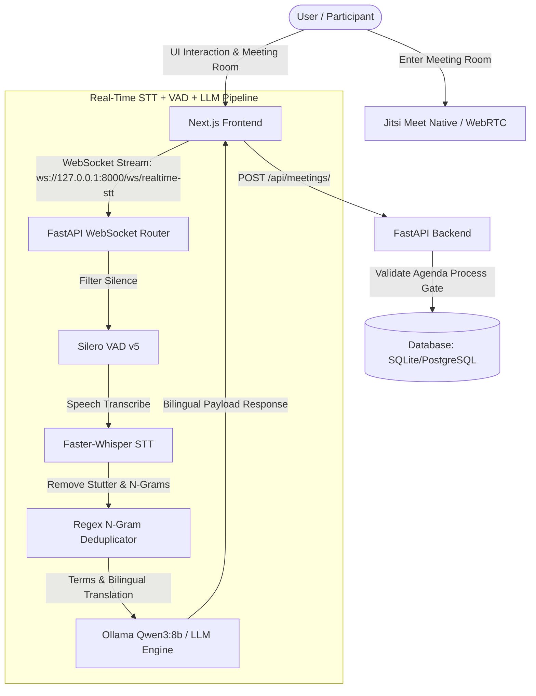

# System Architecture (ARCHITECTURE)

This document provides a detailed technical overview of the Axiom project, built upon the core principles of the DX-OS (Digital Enterprise Operating System) architecture.

## 1. H-P-D-I Overview

Axiom does not implement features randomly. Every line of code and every component must answer the question: Which layer of the DX-OS architecture does it serve?

### 🧑‍💻 H (Human - Interface Layer)

The layer interacting directly with the user, focusing on Clean UI/UX.

- **Technologies:** Next.js 14 (App Router), React 19, Tailwind CSS v4, Shadcn UI.
- **Design Standard:** B2B Enterprise SaaS (Taste Skill), Focus Mode, Electric Blue (#2563eb).
- **Core Implementation:** `src/frontend/src/app/`

### ⚙️ P (Process - Business Logic Gates)

The layer enforcing organizational discipline (e.g., No Agenda = No Meeting).

- **Technologies:** FastAPI, Pydantic (Data Validation).
- **Code Standard:** TDD (Test-Driven Development) defending these gates via `pytest`.
- **Core Implementation:** `src/backend/main.py` and `src/backend/test_main.py`

### 🧠 I (Intelligence - Real-Time AI & Processing)

The digital assistant layer, operating via real-time WebSocket streams and background tasks.

- **Technologies:** Silero VAD v5 (Silence Filtering), Faster-Whisper (Real-time STT), Regex N-Gram & Stutter Deduplicator, Ollama (Qwen3:8b) / Heuristic Fallback Engine.
- **Workflow:**
  1. Live microphone stream captured via Web Audio API & Web Speech API on Next.js frontend.
  2. Binary audio chunks & text utterances streamed over WebSocket (`ws://127.0.0.1:8000/ws/realtime-stt`).
  3. Silero VAD filters out silence (`speech_prob < 0.4`), Faster-Whisper transcribes speech, Regex filters N-gram phrase repetitions (2-8 words) & speech typos.
  4. LLM 2-Stage Semantic Engine extracts technical terms (`WebSocket`, `VAD`, `FastAPI`), performs smart adaptive bilingual translation (English & Vietnamese), and audits semantic validity.

### 🔒 D (Data - Single Source of Truth)

The centralized storage layer, designed for absolute security. It explicitly prevents data leakage to public clouds.

- **Technologies:** SQLite (Dev) -> PostgreSQL (Prod), SQLAlchemy ORM.
- **Core Implementation:** `src/backend/models.py`, `src/backend/database.py`

---

## 2. System Flow (Mermaid)

## 3. Technology Rationale

- **Next.js + Tailwind:** Ultra-fast development speed, SEO optimization via Server Components, and static source code security.
- **FastAPI:** High performance (Async), auto-generated Swagger documentation (OpenAPI), seamless integration with Python AI models.
- **Jitsi Meet:** 100% Open-source, self-hosted friendly infrastructure ensuring total Data Sovereignty for enterprises.
