# System Architecture (ARCHITECTURE)

This document provides a detailed technical overview of the Axiom project, built upon the core principles of the DX-OS (Digital Enterprise Operating System) architecture.

Axiom does not implement features randomly. Every line of code and every component must answer the question: **Which layer of the DX-OS architecture does it serve?**

> For the comprehensive engineering roadmap and product vision, see [`MASTER_PROJECT_PLAN.md`](../MASTER_PROJECT_PLAN.md).

---

## 1. H-P-D-I Deep Dive

### 🧑‍💻 H (Human — Interface Layer)

The layer interacting directly with the user. Its primary goal is to enforce focus, minimize distraction, and provide a premium enterprise aesthetic.

- **Technologies:** Next.js 16 (App Router), React 19, Tailwind CSS v4, Shadcn UI.
- **Design Standard:** B2B Enterprise SaaS, Focus Mode, Electric Blue accents, Plus Jakarta Sans typography.
- **Real-time Engine:** Native LiveKit WebRTC integration via `@livekit/components-react`.
- **Core Implementation:** `src/frontend/`
- **API Client:** Centralized typed client at `src/frontend/src/lib/api.ts` — all backend calls go through one function for consistent error handling and future JWT injection.

### ⚙️ P (Process — Business Logic Gates)

The layer enforcing organizational discipline. In Axiom, process means strict rules (e.g., No Agenda = No Meeting).

- **Technologies:** FastAPI (Python 3.12+), Pydantic V2 (Strict Data Validation).
- **Code Standard:** TDD (Test-Driven Development) defending these gates via pytest. We strictly follow the Red-Green-Refactor cycle.
- **Core Implementation:**
  - `src/backend/api/v1/meetings.py` — Meeting CRUD + Process Gate enforcement
  - `src/backend/schemas/meeting.py` — Pydantic request/response validation
  - `src/backend/core/exceptions.py` — Structured error hierarchy
  - `src/backend/test_main.py` — 35 tests

### 🧠 I (Intelligence — AI Assistants)

The digital assistant layer. It operates silently via background tasks, turning unstructured audio into structured data.

- **Technologies:**
  - **Speech-to-Text (STT):** OpenAI Whisper (Offline capability).
  - **Large Language Model (LLM):** Llama-3 (via Ollama or local inference) for action item extraction and summarization.
- **Workflow:** LiveKit Agents connect to the room, stream audio to Whisper, generate transcripts, and push them to Llama-3 for summarization upon meeting conclusion.
- **Pipeline Diagrams:** See [AI Pipeline Reference](#4-ai-pipeline-reference) below.

### 🔒 D (Data — Single Source of Truth)

The centralized storage layer, designed for absolute security and data sovereignty.

- **Technologies:** SQLite (for local development) → PostgreSQL (for production). SQLAlchemy ORM.
- **Migrations:** Alembic with auto-generated migrations from model changes.
- **Core Implementation:** `src/backend/models.py`, `src/backend/database.py`

---

## 2. Backend Module Structure

```
src/backend/
├── main.py                    # App factory — creates FastAPI, mounts routes
├── database.py                # Engine, SessionLocal, Base (from config)
├── models.py                  # SQLAlchemy models (Meeting, ActionItem)
├── test_main.py               # 35 TDD tests
│
├── core/                      # Cross-cutting concerns
│   ├── config.py              # Pydantic Settings (all env vars centralized)
│   └── exceptions.py          # AppException hierarchy + global handlers
│
├── schemas/                   # API data contracts
│   └── meeting.py             # MeetingCreate, MeetingResponse, TokenResponse
│
├── api/                       # HTTP layer
│   ├── deps.py                # Shared dependencies (get_db)
│   └── v1/                    # Versioned API
│       ├── router.py          # Root + V1 router aggregation
│       ├── health.py          # GET /, GET /health
│       └── meetings.py        # Meeting CRUD + Process Gate + Token
│
└── alembic/                   # Database migrations
    ├── env.py                 # Configured with app models + settings
    └── versions/              # Migration history
```

---

## 3. Architectural Diagrams

### System Context (C4 Model)

How Axiom interacts with users and external/internal systems.

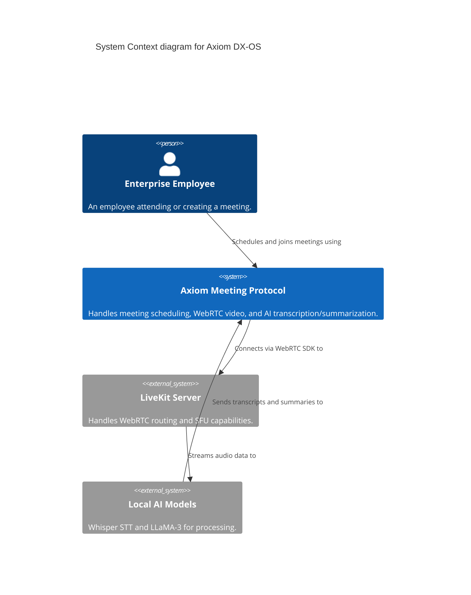

### Meeting Creation & Validation Sequence

Demonstrating the **Process (P)** gate in action.

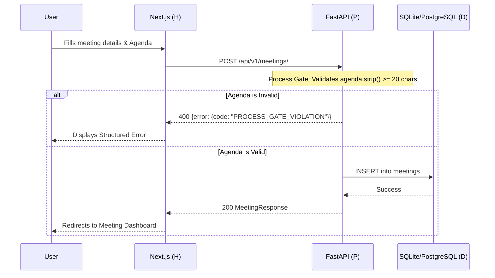

### LiveKit WebRTC & Intelligence Pipeline

Demonstrating the **Intelligence (I)** pipeline.

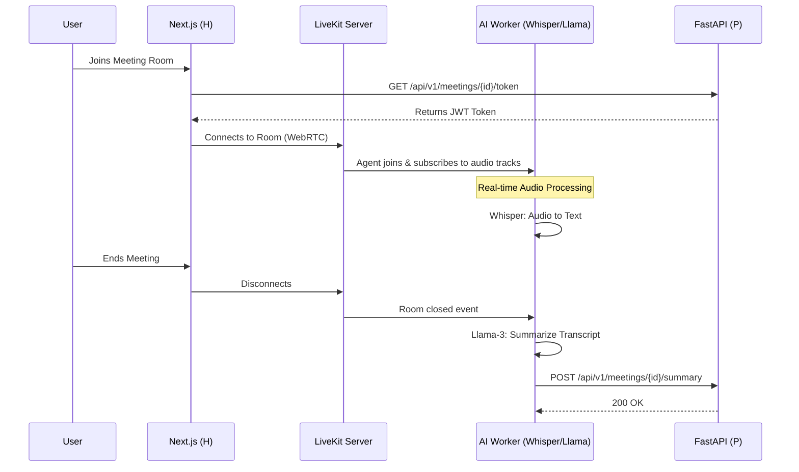

### Structured Error Response Flow

All errors follow a consistent JSON format:

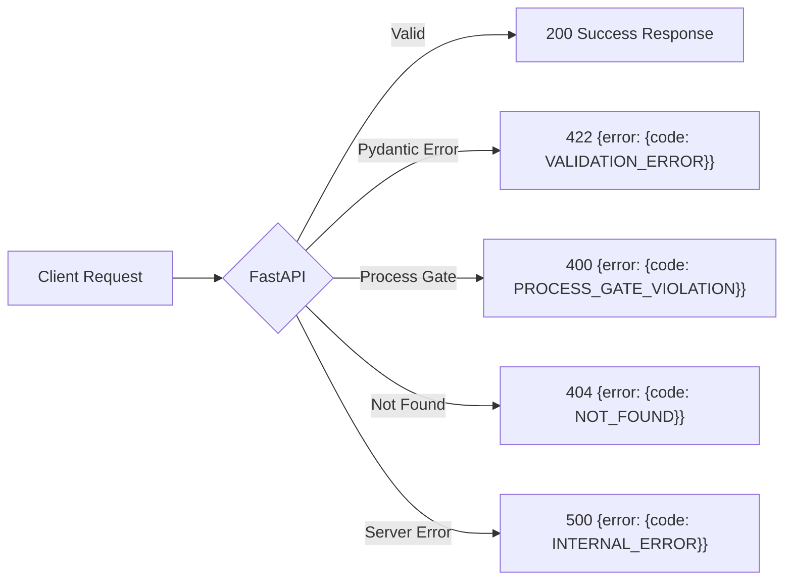

---

## 4. AI Pipeline Reference

The following pipeline diagrams illustrate the full AI Intelligence architecture planned for Axiom. These are part of the product vision documented in [`MASTER_PROJECT_PLAN.md`](../MASTER_PROJECT_PLAN.md).

| Pipeline | Diagram |
|:---|:---|
| 1. Meeting Lifecycle | 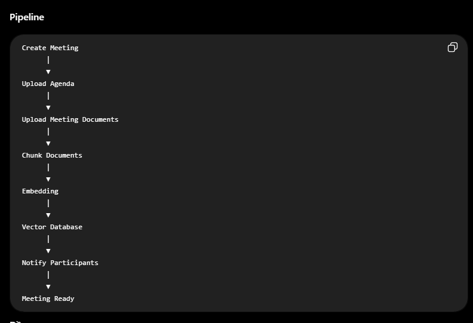 |
| 2. Audio Streaming | 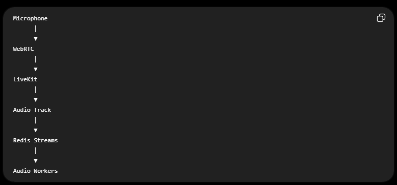 |
| 3. Speech-to-Text | 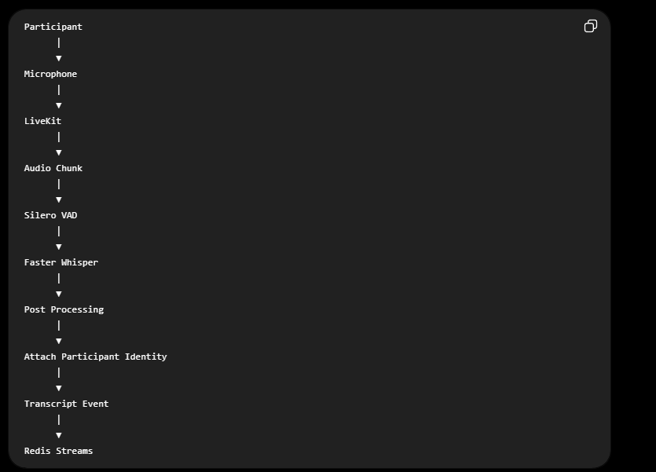 |
| 4. Transcript Processing | 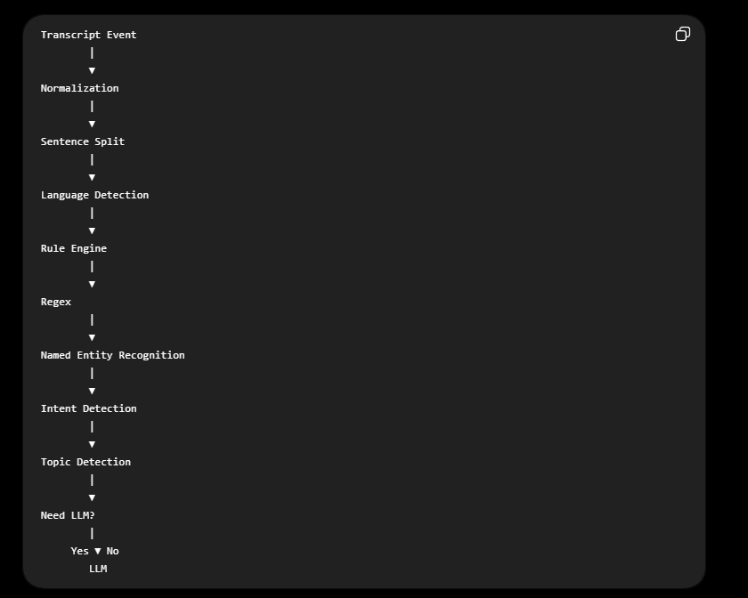 |
| 5. Meeting State | 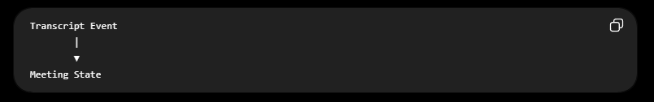 |
| 6. Meeting State Schema | 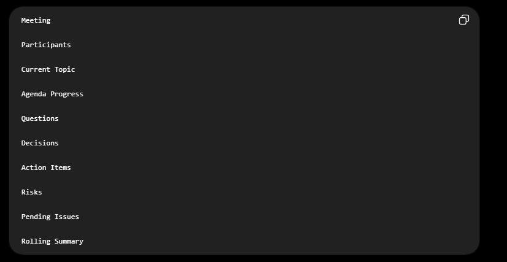 |
| 7. AI Orchestration | 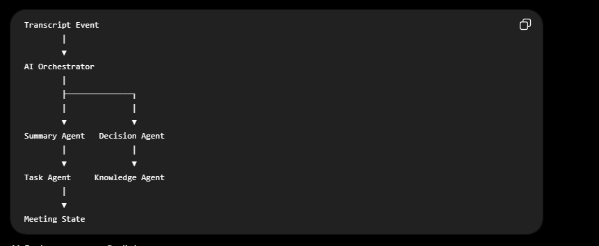 |
| 8. Rolling Summary | 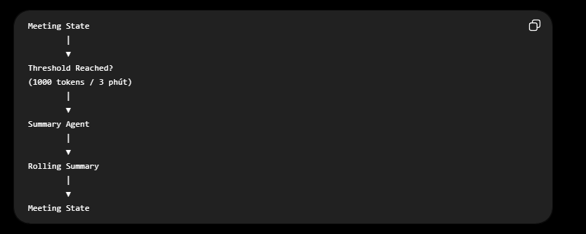 |
| 9. Knowledge Hub | 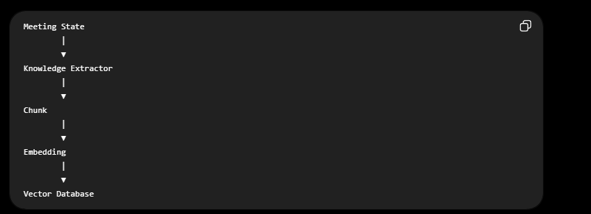 |
| 10. Knowledge Schema | 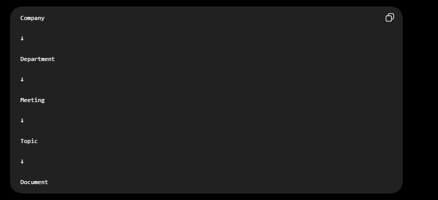 |
| 11. RAG & AI Chat | 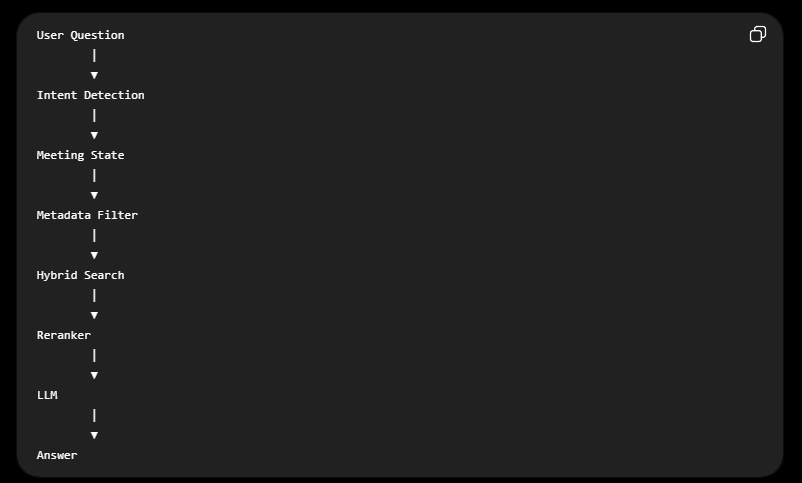 |
| 12. Client Sync | 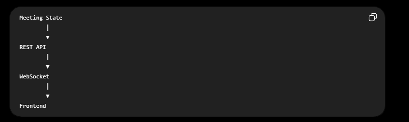 |
| 13. Full System Overview | 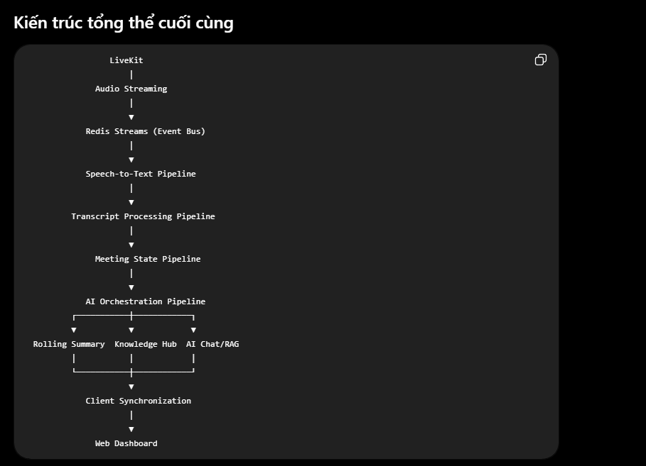 |

---

## 5. Technology Rationale & Design Decisions (ADRs)

### ADR 1: Why Next.js (App Router) + Tailwind CSS?

- **Speed & SEO:** Server Components provide excellent load times and SEO optimization.
- **Ecosystem:** Shadcn UI and Tailwind allow rapid prototyping of high-quality B2B interfaces without massive CSS overhead.
- **Security:** Static site generation and server-side logic minimize client-side attack vectors.

### ADR 2: Why FastAPI + Pydantic?

- **Performance:** Asynchronous capabilities natively built-in.
- **Type Safety:** Pydantic V2 ensures that data entering the system is strictly validated, which is essential for the Process (P) layer.
- **Ecosystem integration:** Python is the undisputed king of AI. Using FastAPI allows seamless integration with LiveKit's Python Server SDK and AI models (Whisper/Llama).

### ADR 3: Why LiveKit instead of Jitsi/Twilio?

- **Data Sovereignty:** LiveKit can be easily self-hosted, ensuring voice/video streams never touch a third-party cloud.
- **AI Readiness:** LiveKit Agents (written in Python/Go) provide incredible infrastructure for real-time STT and LLM processing directly on the audio streams.
- **Modern WebRTC:** Superior SFU (Selective Forwarding Unit) architecture compared to legacy solutions.

### ADR 4: Why Alembic for Migrations?

- **Version Control for DB:** Track every schema change as a migration file, enabling rollbacks and team collaboration.
- **Auto-generate:** Detects model changes and generates migration scripts automatically.
- **Production Safety:** No more `Base.metadata.create_all()` which drops data on schema changes.

### ADR 5: Why Centralized Exception Handling?

- **Consistent API:** Every error returns `{error: {code, message, detail}}` — frontend only needs to check one format.
- **Process Gate Clarity:** Business rule violations (`PROCESS_GATE_VIOLATION`) are distinguished from validation errors (`VALIDATION_ERROR`) and system errors (`INTERNAL_ERROR`).
